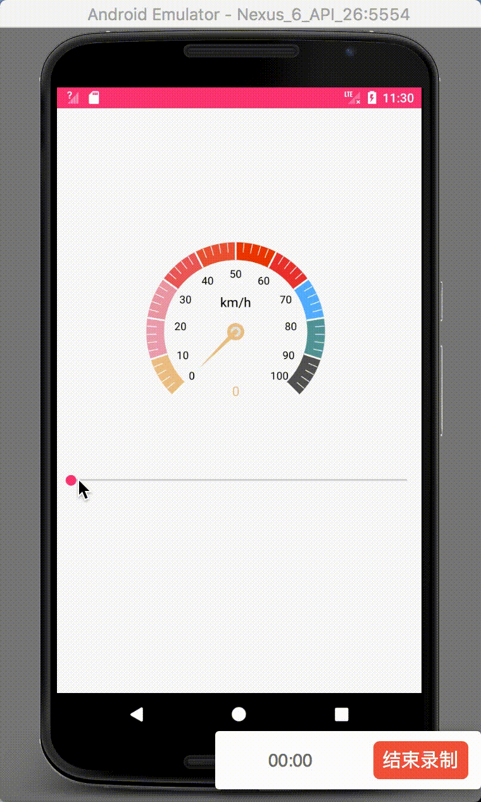
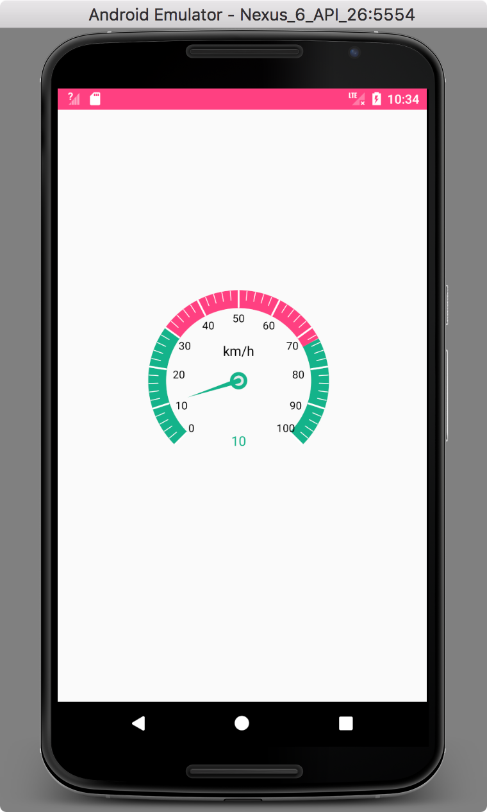
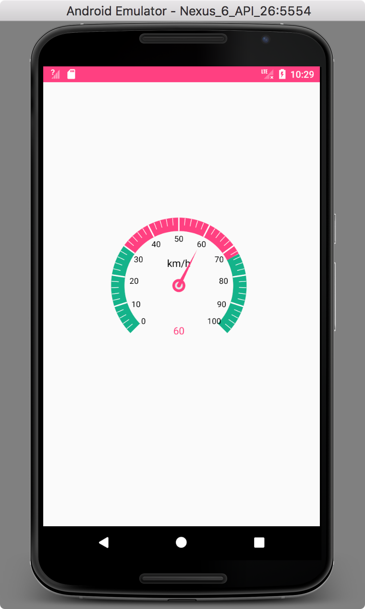
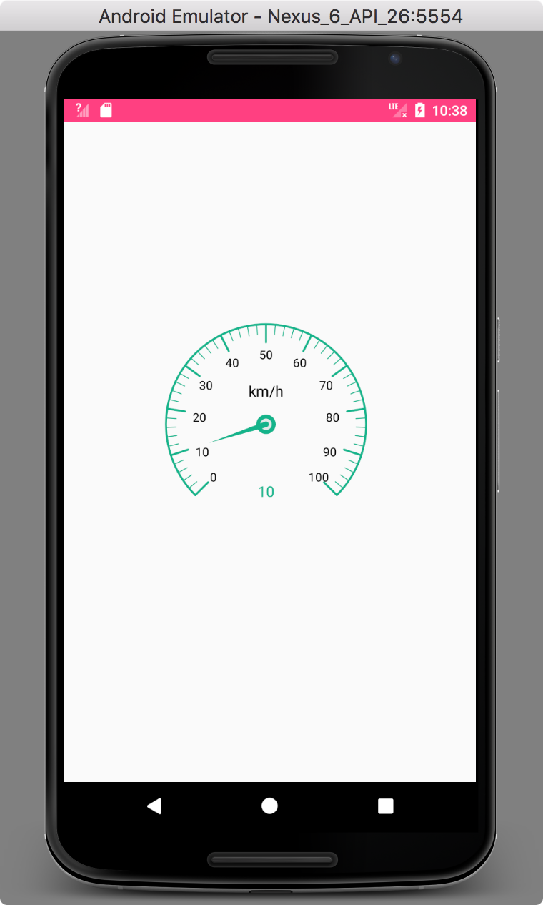

# Android DashBoard 仪表盘

## 效果图：

  

## 使用方法：
### 在xml您可以这样使用它

    <com.dashboard.trc.DashboardView
        android:id="@+id/dashboardView"
        android:layout_width="wrap_content"
        android:layout_height="wrap_content"
        android:layout_centerHorizontal="true"
        android:layout_marginLeft="100dp"
        android:layout_marginTop="150dp"
        android:foregroundGravity="center"
        app:bigSliceCount="6"
        app:headerRadius="20dp"
        app:headerTitle="km/h"
        app:maxValue="240"
        app:measureTextSize="12sp"
        app:radius="100dp"
        app:startAngle="135"
        app:stripeMode="inner"
        app:stripeWidth="16dp"
        app:sweepAngle="270" />

### 当然你也可以在代码中使用它

        dashboardView.setSmallSliceRadius(90);
        dashboardView.setBigSliceRadius(120);
        /**设置字体颜色*/
        dashboardView.setTextColor(Color.BLACK);
        /***/
        dashboardView.setBigSliceCount(10);
        /***/
        dashboardView.setStripeWidth(20);
        /***/
        dashboardView.setHeaderRadius(40);
        /***/
        dashboardView.setHeaderTextSize(15);
        /***/
        dashboardView.setPointerRadius(60);
        /***/
        dashboardView.setStripeMode(DashboardView.StripeMode.INNER);
        /**设置*/
        dashboardView.setArcColor(Color.WHITE);
        /**设置*/
        dashboardView.setNumMeaRadius(10);
        dashboardView.setRealTimeValue(10);
        /**设置最大最下值*/
        dashboardView.setMaxValue(100);
        dashboardView.setMinValue(0);
        /**设置仪表盘的色带颜色*/
        List<AngleBean> data = new ArrayList<>();
        data.add(new AngleBean(0,30,"#14b38a"));
        data.add(new AngleBean(30,70,"#14b38a"));
        data.add(new AngleBean(70,100,"#14b38a"));
        dashboardView.setStripeHighlightColorAndRange(DashBoardManager.calibration2Angle(data, dashboardView));

