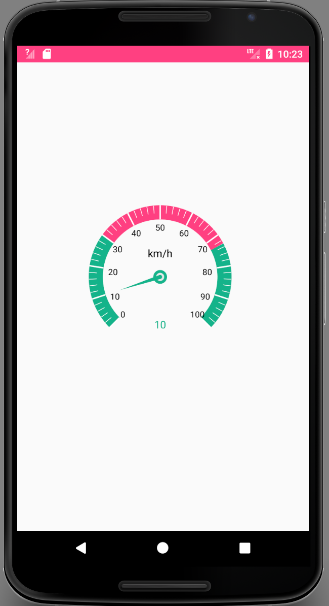
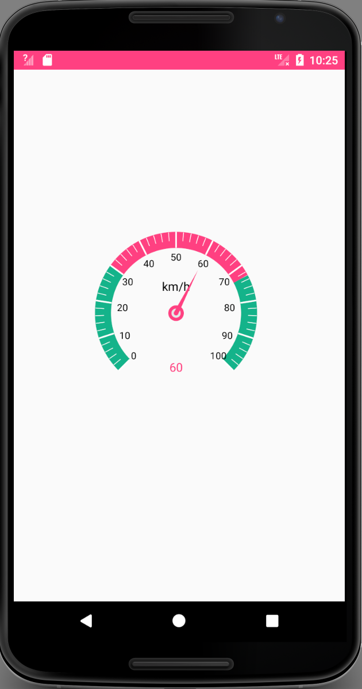
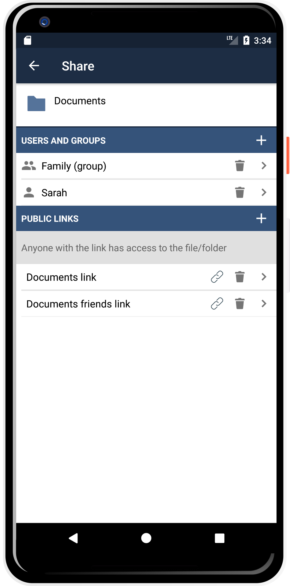

# dashboard
Android 仪表盘。

    使用方法：
        /***/
        dashboardView.setSmallSliceRadius(90);
        dashboardView.setBigSliceRadius(120);
        /**设置字体颜色*/
        dashboardView.setTextColor(Color.BLACK);
        /***/
        dashboardView.setBigSliceCount(10);
        /***/
        dashboardView.setStripeWidth(20);
        /***/
        dashboardView.setHeaderRadius(40);
        /***/
        dashboardView.setHeaderTextSize(15);
        /***/
        dashboardView.setPointerRadius(60);
        /***/
        dashboardView.setStripeMode(DashboardView.StripeMode.INNER);
        /**设置*/
        dashboardView.setArcColor(Color.WHITE);
        /**设置*/
        dashboardView.setNumMeaRadius(10);
        dashboardView.setRealTimeValue(10);
        /**设置最大最下值*/
        dashboardView.setMaxValue(100);
        dashboardView.setMinValue(0);
        /**设置仪表盘的色带颜色*/
        List<AngleBean> data = new ArrayList<>();
        data.add(new AngleBean(0,30,"#14b38a"));
        data.add(new AngleBean(30,70,"#14b38a"));
        data.add(new AngleBean(70,100,"#14b38a"));
        dashboardView.setStripeHighlightColorAndRange(DashBoardManager.calibration2Angle(data, dashboardView));

# Android 仪表盘

  

## Join development!

**Build status:** master  stable 

**Start contributing:** Make sure you read [SETUP.md](https://github.com/owncloud/android/blob/master/SETUP.md) when you start working on this project. Basically: Fork this repository and contribute back using pull requests to the master branch.
Easy starting points are also reviewing [pull requests](https://github.com/owncloud/android/pulls) and working on [junior jobs](https://github.com/owncloud/android/issues?q=is%3Aopen+is%3Aissue+label%3A%22Junior+Job%22).

**IRC channel:** [#owncloud-android](https://webchat.freenode.net/?channels=owncloud-android) on freenode IRC

**Beta version:**

**License:** [GPLv2](https://github.com/owncloud/android/blob/master/LICENSE.txt)
nse:** [GPLv2](https://github.com/owncloud/android/blob/master/LICENSE.txt)